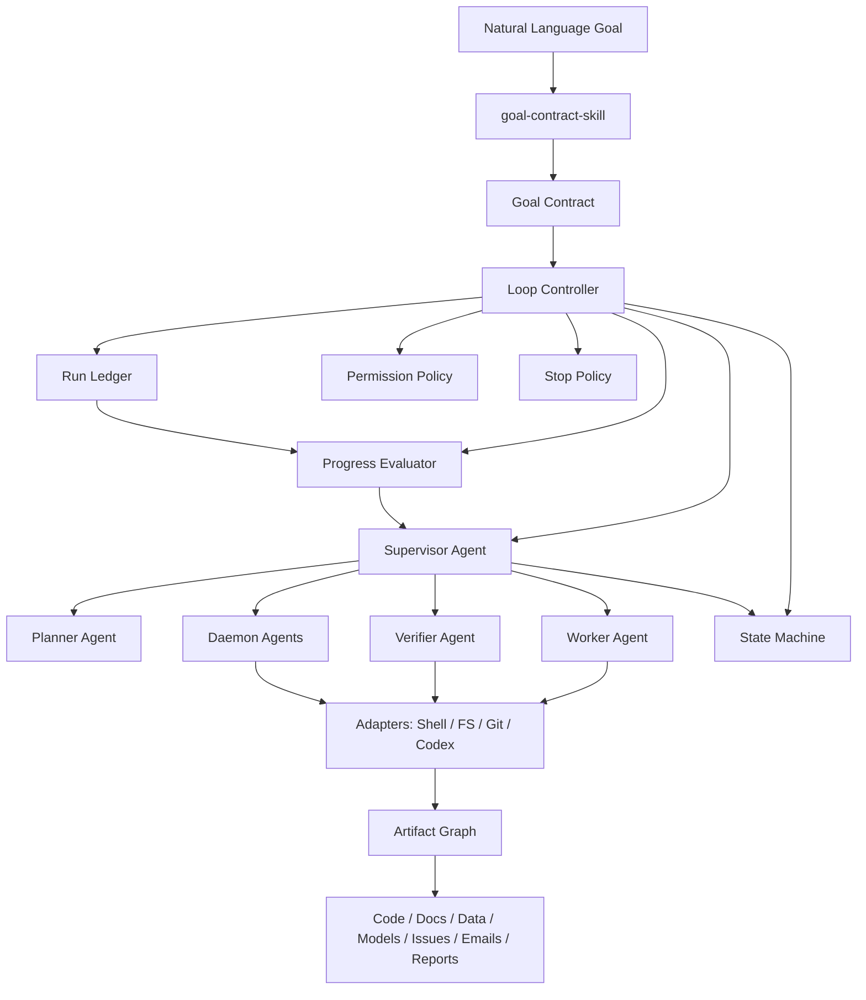
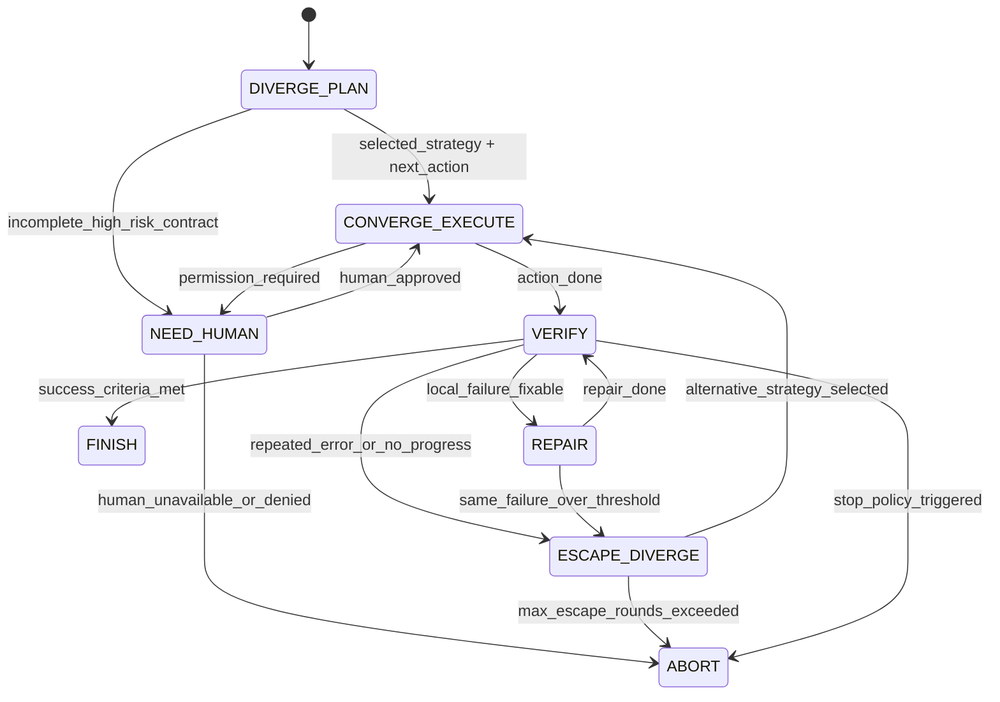

# Codex Autonomous Harness Framework Plan

## 1. 需求理解与设计原则

目标是设计一套外部运行协议，而不是单纯提示词集合。Codex / Worker Agent 可以自主执行，但所有执行都必须被 `Goal Contract`、`Permission Policy`、`Run Ledger`、`Progress Evaluator`、`Loop Controller` 和 `Supervisor Agent` 约束。

当前工作区 `C:\Users\11301\Desktop\code\ai-code\harness` 为空，因此建议按新框架从零设计。`Skill Creator` 的约束是：skill 要短小、可触发、可组合；复杂 schema、示例、检查脚本放进 `references/` 和 `scripts/`，不要把全部逻辑塞进 `SKILL.md`。

核心原则：

- **Skill 负责方法论与结构化产出**：规划、评估、逃逸、恢复、场景策略。
- **TypeScript 负责强约束执行**：状态机、预算、权限、ledger、停止条件、适配器、CLI。
- **Supervisor 不执行具体任务**：只评估、切阶段、控预算、防漂移。
- **Worker 不决定是否无限继续**：每轮必须被 Loop Controller 记录和评估。
- **所有任务对象统一为 Artifact Graph**：代码、文档、数据、模型、邮件、任务都作为 artifact 处理。
- **默认保守权限**：无确认不等于无限权限，高风险操作进入 `NEED_HUMAN` 或 `ABORT`。

## 2. 总体架构



职责分层：

- **Runtime Core TypeScript**：强制状态流转、预算、权限、ledger schema、错误签名、进展指标、恢复策略。
- **Skills**：生成结构化计划、单步执行协议、验证解析、逃逸发散、恢复报告、场景专用策略。
- **Agents**：运行角色边界。Agent 是 runtime 调用 skill 和 adapter 的执行单元。
- **Adapters**：对外部世界做最小封装，例如 shell、git、文件系统、Codex subagent、邮件、数据源。
- **Artifact Graph**：记录 artifact 类型、关系、影响范围和验证路径。

## 3. 核心状态机

状态集合：

- `DIVERGE_PLAN`：发散理解目标、列假设、生成候选策略。
- `CONVERGE_EXECUTE`：执行一个小步、可验证动作。
- `VERIFY`：验证动作结果。
- `REPAIR`：基于当前失败做局部修复。
- `ESCAPE_DIVERGE`：跳出重复错误或局部最优。
- `FINISH`：成功完成。
- `NEED_HUMAN`：缺少高风险决策或权限。
- `ABORT`：失败或安全停止。



每轮固定流程：

```ts
observe();
decision = supervisor.decide(context);
permissionPolicy.assertAllowed(decision.action);
result = worker.act(decision);
verification = verifier.verify(result);
ledger.record({ decision, result, verification });
metrics = progressEvaluator.evaluate(ledger.window());
nextPhase = stateMachine.transition(currentPhase, metrics, policies);
stopPolicy.assertContinue(context);
```

关键规则：

- `CONVERGE_EXECUTE` 每轮只能做一个明确动作。
- `VERIFY` 后必须写 ledger，不能跳过评估。
- `REPAIR` 只能处理当前错误签名相关范围。
- `ESCAPE_DIVERGE` 必须总结失败路径，给出至少 3 个新假设，并选择与当前路径差异最大的策略。
- `FINISH` 必须证明满足 `Goal Contract`。
- `ABORT` 必须输出失败路径、当前状态和人工介入建议。

## 4. Goal Contract 与 Run Ledger

`Goal Contract` 最小 schema：

```yaml
goal:
  id: string
  name: string
  objective: string
  background: string
  expected_outputs: string[]

scope:
  allowed_artifacts: string[]
  forbidden_artifacts: string[]
  allowed_operations: string[]
  forbidden_operations: string[]

success_criteria: string[]

verification:
  commands: string[]
  checks: string[]
  quality_gates: string[]

budget:
  max_iterations: number
  max_same_error: number
  max_no_progress: number
  max_escape_rounds: number
  max_changed_artifacts: number
  max_runtime_minutes: number

risk_policy:
  destructive_actions: forbidden | require_explicit_approval | allowed_in_sandbox
  external_network: forbidden | restricted | allowed
  secret_access: forbidden | restricted

stop_conditions:
  success: string[]
  fail: string[]
```

`Run Ledger` 每轮记录：

```json
{
  "iteration": 1,
  "phase": "CONVERGE_EXECUTE",
  "goal_id": "...",
  "current_hypothesis": "...",
  "action": "...",
  "changed_artifacts": ["..."],
  "commands_run": ["..."],
  "verification_result": "pass",
  "error_signature": "...",
  "progress_signal": "positive",
  "new_information": ["..."],
  "metrics": {
    "objective_delta": 0.2,
    "failure_count_delta": -3,
    "scope_drift_score": 0.0,
    "repeated_action_count": 0
  },
  "next_phase": "VERIFY"
}
```

Progress Metrics：

```yaml
objective_delta: number
error_signature_changed: boolean
failure_count_delta: number
new_information_found: boolean
artifact_quality_delta: number
scope_drift_score: number
repeated_action_count: number
repeated_error_count: number
no_progress_count: number
changed_artifacts_count: number
confidence_delta: number
```

## 5. Skill 设计

所有 skill 采用 Skill Creator 规范：每个 skill 一个短 `SKILL.md`，复杂 schema 放 `references/`，稳定检查逻辑放 `scripts/`。

| Skill                      | Purpose                      | Inputs                                     | Outputs                                              | When to use         | Failure modes                              |
| -------------------------- | ---------------------------- | ------------------------------------------ | ---------------------------------------------------- | ------------------- | ------------------------------------------ |
| `goal-contract-skill`      | 自然语言目标转 Goal Contract | 用户目标、环境摘要、风险偏好               | contract yaml/json、缺口列表                         | 每个 run 开始       | 目标过宽、成功标准不可验证、高风险信息缺失 |
| `planning-skill`           | 发散规划和候选策略           | contract、artifact graph、历史 ledger      | `DIVERGE_PLAN` JSON                                  | 初始规划或逃逸后    | 方案过大、没有可执行下一步                 |
| `execution-skill`          | 单步收敛执行协议             | 当前 phase、action、scope、permissions     | action result、changed artifacts                     | Worker 执行动作前后 | 一步太大、越权、产物不可验证               |
| `verification-skill`       | 验证与错误签名               | action result、commands、checks、artifacts | verify result、error signature、quality gate result  | 每轮执行后          | 无法解析输出、验证信号不稳定               |
| `progress-evaluator-skill` | 判断真实进展                 | ledger window、metrics、contract           | progress decision、next phase suggestion             | 每轮 verify 后      | 自我合理化、误判局部改善                   |
| `escape-divergence-skill`  | 跳出卡住路径                 | repeated errors、failed hypotheses、ledger | failure summary、3+ hypotheses、alternative strategy | 重复错误或无进展    | 新策略与旧路径差异不够                     |
| `recovery-skill`           | 恢复与人工报告               | diff、ledger、failed checks                | keep/revert advice、human report                     | ABORT、失败逃逸后   | 误删有效修改、报告不可操作                 |
| `supervisor-skill`         | 监督 phase 与预算            | contract、ledger、diff、verification       | next decision、stop/continue/recover                 | 每轮控制点          | Supervisor 越权执行具体任务                |
| `daemon-agent-skill`       | 定义 daemon 生命周期         | trigger、scope、budget、mode               | daemon spec、ledger protocol                         | 后台维护任务        | 无限运行、绕过 supervisor                  |
| `artifact-modeling-skill`  | 统一 artifact graph 建模     | repo/data/task inventory                   | nodes、edges、impact scope                           | 所有场景初始化      | 关系过粗、影响范围误判                     |
| `data-analysis-skill`      | 数据分析流程                 | dataset artifacts、analysis goal           | data checks、analysis plan、confidence report        | 数据分析场景        | 数据质量差、结论不可验证                   |
| `auto-modeling-skill`      | 自动建模流程                 | dataset、target、metrics、budget           | experiment plan、model comparison                    | 建模场景            | 泄漏、过拟合、无基线                       |
| `model-optimization-skill` | 自动优化循环                 | baseline、metric history、budget           | next experiment、stop decision                       | 调参优化            | 收益递减仍继续、盲目搜索                   |

MVP 必需 skill：

- `goal-contract-skill`
- `planning-skill`
- `execution-skill`
- `verification-skill`
- `progress-evaluator-skill`
- `escape-divergence-skill`
- `supervisor-skill`
- `daemon-agent-skill`
- `artifact-modeling-skill`

## 6. Agent 设计

| Agent                            | Responsibility                 | Allowed actions                               | Forbidden actions            | Input               | Output                 | Lifecycle                    |
| -------------------------------- | ------------------------------ | --------------------------------------------- | ---------------------------- | ------------------- | ---------------------- | ---------------------------- |
| Supervisor Agent                 | 总控、阶段切换、预算、漂移检查 | 读 contract/ledger/diff/verify result，发决策 | 直接改文件、直接跑任务       | context snapshot    | next phase/action/stop | 每轮常驻                     |
| Worker Agent                     | 执行具体动作                   | 小步编辑、运行允许命令、产生产物              | 自行扩大 scope、自行忽略权限 | supervised action   | action result          | 每个 action 一次             |
| Planner Agent                    | 发散规划                       | 生成候选方案、风险、任务拆分                  | 执行修改                     | goal + graph        | structured plan        | 初始和 escape 时             |
| Verifier Agent                   | 验证和解析                     | 运行验证、提取错误签名                        | 修复代码                     | commands/checks     | verification result    | 每轮执行后                   |
| Refactor Agent                   | 渐进重构                       | 影响分析、小步迁移、保持行为                  | 一次性大改、无测试重构       | refactor contract   | migration step         | 重构场景启用                 |
| Bug Finder/Fixer Agent           | 定位和修复 bug                 | 建假设、最小复现、小修                        | 盲修、无复现大改             | bug report + logs   | fix + evidence         | bug 场景启用                 |
| Documentation Consistency Daemon | 文档一致性                     | 检查 README/API/架构图，默认报告              | 默认不得 auto patch          | changed artifacts   | stale doc report       | trigger 后短运行             |
| Architecture Consistency Daemon  | 架构边界                       | 依赖方向、循环依赖、分层检查                  | 自动重构架构                 | graph + diff        | architecture report    | trigger 后短运行             |
| Test Coverage Daemon             | 测试覆盖                       | 检查新增行为缺测试                            | 默认不得写测试，除非授权     | diff + tests        | coverage gaps          | goal finished 或 file change |
| Data/Model Optimization Agent    | 实验规划和优化                 | 运行预算内实验、记录指标                      | 无预算无限调参               | experiment contract | comparison + next step | 数据/模型场景启用            |

Daemon spec 默认：

```yaml
daemon:
  name: documentation-consistency-daemon
  trigger: [on_goal_finished, on_file_change]
  scope: ["docs/**", "README*", "src/**"]
  max_runtime: 10
  max_actions_per_run: 3
  output_mode: report_only
  stop_conditions:
    - no_relevant_artifacts_changed
    - max_actions_reached
    - supervisor_denied
```

## 7. TypeScript 模块与核心接口

模块结构：

```text
src/
  core/
    GoalContract.ts
    RunLedger.ts
    StateMachine.ts
    LoopController.ts
    ProgressEvaluator.ts
    StopPolicy.ts
    RecoveryPolicy.ts
    PermissionPolicy.ts
  skills/
    SkillRegistry.ts
    SkillRunner.ts
    SkillContext.ts
  agents/
    Agent.ts
    SupervisorAgent.ts
    WorkerAgent.ts
    PlannerAgent.ts
    VerifierAgent.ts
    DaemonAgent.ts
  artifacts/
    Artifact.ts
    ArtifactGraph.ts
    ArtifactScanner.ts
  adapters/
    CodexAdapter.ts
    ShellAdapter.ts
    GitAdapter.ts
    FileSystemAdapter.ts
  scenarios/
    CodeScenario.ts
    RefactorScenario.ts
    DataAnalysisScenario.ts
    AutoModelingScenario.ts
    DailyWorkScenario.ts
  cli/
    index.ts
```

核心接口：

```ts
export type Phase =
  | "DIVERGE_PLAN"
  | "CONVERGE_EXECUTE"
  | "VERIFY"
  | "REPAIR"
  | "ESCAPE_DIVERGE"
  | "FINISH"
  | "NEED_HUMAN"
  | "ABORT";

export interface GoalContract {
  goal: {
    id: string;
    name: string;
    objective: string;
    background?: string;
    expectedOutputs: string[];
  };
  scope: {
    allowedArtifacts: string[];
    forbiddenArtifacts: string[];
    allowedOperations: string[];
    forbiddenOperations: string[];
  };
  successCriteria: string[];
  verification: {
    commands: string[];
    checks: string[];
    qualityGates: string[];
  };
  budget: {
    maxIterations: number;
    maxSameError: number;
    maxNoProgress: number;
    maxEscapeRounds: number;
    maxChangedArtifacts: number;
    maxRuntimeMinutes: number;
  };
  riskPolicy: RiskPolicy;
  stopConditions: {
    success: string[];
    fail: string[];
  };
}

export interface RunLedgerEntry {
  iteration: number;
  phase: Phase;
  goalId: string;
  currentHypothesis?: string;
  action: string;
  changedArtifacts: string[];
  commandsRun: string[];
  verificationResult: "pass" | "fail" | "partial" | "skipped";
  errorSignature?: string;
  progressSignal: "positive" | "neutral" | "negative";
  newInformation: string[];
  metrics: ProgressMetrics;
  nextPhase: Phase;
  timestamp: string;
}

export interface ProgressMetrics {
  objectiveDelta: number;
  errorSignatureChanged: boolean;
  failureCountDelta: number;
  newInformationFound: boolean;
  artifactQualityDelta: number;
  scopeDriftScore: number;
  repeatedActionCount: number;
  repeatedErrorCount: number;
  noProgressCount: number;
  changedArtifactsCount: number;
  confidenceDelta: number;
}

export interface Skill<I = unknown, O = unknown> {
  name: string;
  run(input: I, context: SkillContext): Promise<O>;
}

export interface Agent<I = unknown, O = unknown> {
  name: string;
  role: string;
  allowedActions: string[];
  forbiddenActions: string[];
  run(input: I, context: HarnessContext): Promise<O>;
}

export interface Artifact {
  id: string;
  type:
    | "source_code"
    | "test"
    | "config"
    | "document"
    | "diagram"
    | "dataset"
    | "notebook"
    | "model"
    | "experiment"
    | "issue"
    | "pr"
    | "email"
    | "task"
    | "report";
  uri: string;
  metadata: Record<string, unknown>;
}

export interface ArtifactEdge {
  from: string;
  to: string;
  relation:
    | "implements"
    | "references"
    | "depends_on"
    | "tests"
    | "documents"
    | "configures"
    | "generates"
    | "validates"
    | "supersedes"
    | "conflicts_with";
}

export interface StateTransition {
  from: Phase;
  to: Phase;
  reason: string;
  metrics: ProgressMetrics;
}

export interface HarnessContext {
  contract: GoalContract;
  phase: Phase;
  ledger: RunLedgerEntry[];
  artifacts: ArtifactGraph;
  permissions: PermissionPolicy;
  runtime: {
    startedAt: string;
    iteration: number;
    escapeRounds: number;
  };
}
```

## 8. 运行流程

1. 用户输入自然语言 goal。
2. `goal-contract-skill` 生成 Goal Contract 初稿。
3. Runtime 补默认预算和保守权限；若高风险信息缺失，进入 `NEED_HUMAN`。
4. `artifact-modeling-skill` + scanner 建立初始 Artifact Graph。
5. `planning-skill` 进入 `DIVERGE_PLAN`，输出假设、策略和第一步。
6. Supervisor 审查策略是否符合 contract、scope、permission。
7. Worker 在 `CONVERGE_EXECUTE` 执行一个小步动作。
8. Verifier 进入 `VERIFY`，运行测试、检查、质量门或非代码验证。
9. Loop Controller 写 Run Ledger。
10. Progress Evaluator 计算进展指标。
11. State Machine 决定 `REPAIR`、继续执行、`ESCAPE_DIVERGE`、`FINISH`、`NEED_HUMAN` 或 `ABORT`。
12. 成功时输出完成报告；失败时输出保留/回滚建议和人工介入报告。
13. Daemon Agent 在指定 trigger 后运行，默认 `report_only`，同样写 ledger 且受 Supervisor 控制。

## 9. 防死循环机制

重复错误识别：

- 对测试名、错误类型、堆栈顶部、失败断言、退出码、关键日志做归一化 hash。
- `repeated_error_count >= max_same_error` 触发 `ESCAPE_DIVERGE`。
- 同一错误签名下 diff 增加但 failure count 不下降，视为负进展。

无进展识别：

- `objective_delta <= 0` 且 `new_information_found = false`。
- 连续重复同一命令且输出 hash 不变。
- 失败数量不变或增加。
- 修改 artifact 数量增加但质量门未改善。
- `scope_drift_score` 超阈值。
- 同一 hypothesis 多轮只做局部补丁。

收敛到发散切换：

- `VERIFY` 或 `REPAIR` 后由 Supervisor 触发。
- `ESCAPE_DIVERGE` 必须冻结当前路径，不允许立刻继续原修复。
- 输出失败路径摘要、失效原因、至少 3 个替代假设。
- 选择与当前路径差异最大的方案重入 `CONVERGE_EXECUTE`。

停止条件：

- 成功标准全部满足且质量门通过。
- 达到 `max_iterations`、`max_no_progress`、`max_escape_rounds`。
- 权限越界或 destructive action 被拒绝。
- 修改范围超过 `max_changed_artifacts`。
- 目标不完整且无法安全补默认值。
- 长期验证无改善。

## 10. 场景适配

代码编写：

- Goal Contract 指定新增模块、测试、验收行为。
- Artifact Graph 建立 source ↔ test ↔ config 关系。
- 验证为 test/typecheck/lint/build。
- 防循环依赖错误签名、失败测试数量、diff 范围。

项目重构：

- Refactor Agent 先识别模块边界和依赖方向。
- 每轮迁移一个小单元，保持旧行为验证通过。
- Test Coverage Daemon 检查迁移路径缺失测试。
- Architecture Daemon 检查循环依赖和分层破坏。

Bug 修复：

- Bug Finder/Fixer 先建立假设和最小复现。
- error signature 绑定接口、日志、堆栈、输入条件。
- 没有复现不得大规模修改。
- 同一假设反复失败进入 `ESCAPE_DIVERGE`。

文档一致性：

- Documentation Daemon 默认 `report_only`。
- 通过 code artifact 与 docs artifact 的 `documents/references` 边判断过期。
- 只有明确允许时 `suggest_patch` 或 `auto_patch`。

数据分析：

- Dataset、notebook、report、query 都是 artifact。
- 先跑数据质量检查：缺失、异常、重复、采样偏差、字段含义。
- 分析结论必须绑定数据证据、查询或统计结果。
- 不满足质量门时输出可信度限制。

自动建模：

- 拆为数据检查、baseline、特征、训练、验证、比较。
- 每个实验写 experiment artifact。
- 比较统一 metric、数据切分、随机种子。
- 防止数据泄漏和只报最优不报失败实验。

模型优化：

- Goal Contract 明确主指标、约束指标和实验预算。
- Progress Evaluator 追踪收益递减。
- 连续多轮低于最小提升阈值停止。
- 不允许无限调参或无记录调参。

日常工作自动化：

- 邮件、会议、任务、计划、报告都是 artifact。
- Daily Work Daemon 按 scheduled/manual trigger 短运行。
- 默认只生成计划和审计记录，不自动发送邮件或改外部系统。
- Goal Contract 限定当天目标，避免任务漂移。

## 11. MVP 路线

MVP：

- 建立 TypeScript core：`GoalContract`、`RunLedger`、`StateMachine`、`LoopController`、`ProgressEvaluator`、`PermissionPolicy`。
- 实现 8 个基础 skill：contract、planning、execution、verification、progress、escape、supervisor、daemon。
- 支持一个代码任务场景：例如 webhook 验签模块的实现计划、测试验证、错误签名、逃逸。
- 支持一个非代码任务场景：例如 CSV 数据质量检查和分析报告。
- 实现一个 daemon 示例：Documentation Consistency Daemon，默认 `report_only`。
- CLI 提供 `harness init-contract`、`harness run --dry-policy`、`harness ledger inspect`。

增强版本：

- 完整 Artifact Graph scanner。
- Git diff、test parser、lint parser、data quality parser。
- Codex subagent adapter。
- Refactor、Bug Fix、Data Analysis、Auto Modeling 场景包。
- 可配置 permission profiles：`sandbox`、`workspace`、`production`.

完整版本：

- 多 Agent 并行调度。
- 长任务 resume / checkpoint。
- Daemon trigger scheduler。
- 实验追踪和模型优化面板。
- 外部系统 adapter：GitHub、邮件、日历、数据仓库。
- 质量评估 dashboard 和历史 run 对比。

## 12. 风险点与替代方案

主要风险：

- Skill 过多导致触发和维护复杂。
- 结构化输出不稳定，需要 TypeScript schema 校验。
- Progress Metrics 过抽象，早期可能误判。
- Artifact Graph 建模成本高，MVP 不应追求全自动完美。
- Daemon 若默认 auto patch，容易越权或产生噪音。

替代方案：

- MVP 先做一个 `autonomous-harness` 总控 skill，加少量核心子 skill；稳定后再拆细。
- Artifact Graph 初期用轻量 manifest + scanner，不做完整知识图谱。
- Progress Evaluator 先用规则引擎，后续再加入 LLM 评审。
- Daemon 初期全部 `report_only`，只允许人工提升到 `suggest_patch` 或 `auto_patch`。

## 13. 后续实现步骤

1. 用 Skill Creator 初始化 `autonomous-harness` 相关 skill 目录，并放入 schema references。
2. 搭建 TypeScript 项目骨架和核心接口。
3. 实现 Goal Contract schema 校验和默认值补全。
4. 实现 Run Ledger append-only 存储。
5. 实现状态机和 Loop Controller。
6. 实现 Progress Evaluator 的第一版规则。
7. 接入 shell/fs/git adapter 的权限检查。
8. 做两个端到端样例：代码任务与非代码数据分析任务。
9. 增加 Documentation Consistency Daemon 示例。
10. 通过真实任务回放迭代 skill 内容和 metrics 阈值。